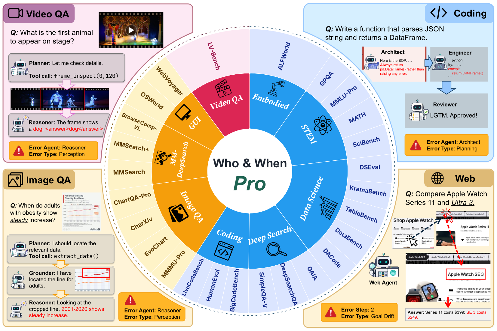

# Who&When Pro

### Can LLMs Really Attribute Failures in AI Agents?

[Project page](https://whowhenpro.github.io/) · Paper (coming soon) · Dataset (coming soon)

## Introduction

When an AI agent fails, effective diagnosis requires identifying both the first
decisive error (the *when*) and the agent or component responsible for it (the
*who*). **Who&When Pro** is a benchmark for evaluating this capability in LLMs.
Its warm-start injection pipeline replays a successful trajectory up to a
selected step, introduces one error, and lets the agent continue, producing
exact failure labels by construction. The benchmark contains **12,326 failed
trajectories** across **26 source benchmarks**, **nine task families**, **18
error modes**, and text, image, and video modalities. Results on frontier LLMs
show that reliable failure attribution remains challenging, especially for
multimodal traces and root-cause classification.

## Dataset Illustration

  

**Figure 1: Who&When Pro dataset illustration.** The inner ring groups the 26
source benchmarks into nine task categories, while the outer ring maps each
benchmark to its modality.

## Benchmark Tasks

Given a failed agent trajectory, a model is evaluated on:

- **Agent attribution:** identify the responsible agent or component.
- **Step localization:** identify the first decisive error step.
- **Error classification:** identify the underlying failure mode.
- **Joint attribution:** answer all three correctly for the same trajectory.

## How to Use

> [!IMPORTANT]
> The evaluation code and benchmark data are not public yet. Installation and
> runnable commands will be added with the first release.

Once released, the expected workflow will be:

1. Install the package and its dependencies.
2. Download the benchmark data and configure model credentials.
3. Run inference on one or more benchmark splits.
4. Evaluate predictions with the official attribution metrics.

The release will include commands for reproducing the reported experiments,
evaluating a custom model, and scoring existing prediction files. Until then,
please follow the [project page](https://whowhenpro.github.io/) for updates.

## Repository Status

- [ ] Evaluation code
- [ ] Benchmark data and download instructions
- [ ] Environment and dependency specification
- [ ] Reproduction scripts and model configurations
- [ ] Prediction format and custom-model documentation
- [ ] Paper and citation

## Citation

Citation information will be added when the paper is released.

## Contact

For questions or release notifications, please open a GitHub issue.
